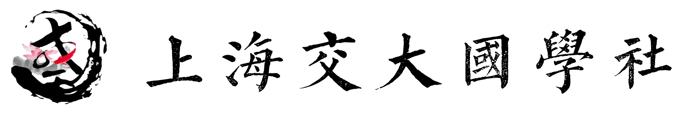

<div align="center">                                                                                       
                 
</div>

<div align="center">

# NEO-CLASSIC: A Benchmark for Evaluating Linguistic-Aesthetic Reasoning in Classical Chinese Poetry

Han Zhang<sup>1,\*</sup> &ensp; Zihan Gu<sup>2,\*</sup> &ensp; Zhiyuan Wang<sup>1</sup> &ensp; Tianyi Ma<sup>1</sup> &ensp; Jiacheng Lu<sup>1</sup> &ensp; Xinyan Zhang<sup>4</sup> &ensp; Yuhao Wei<sup>3</sup> &ensp; Cheng Hua<sup>1,†</sup>

<sup>1</sup>Shanghai Jiao Tong University &emsp; <sup>2</sup>Institute of Information Engineering, CAS &emsp; <sup>3</sup>UCAS &emsp; <sup>4</sup>Independent Researcher

<sup>\*</sup>Equal contribution &emsp; <sup>†</sup>Corresponding author

[](link)
[](LICENSE)
[](#benchmark-tasks)

</div>

## Overview

While Large Language Models achieve high accuracy on established Classical Chinese Poetry (CCP) benchmarks, it remains difficult to distinguish transferable **Linguistic-Aesthetic Reasoning** from reliance on familiar pre-training patterns. **NEO-CLASSIC** addresses this by combining:

1. A **constructionist Out-of-Sample (OOS) dataset** of 1,406 strictly metrical works authored by 30 contemporary poets, reducing the possibility of direct retrieval from training corpora.
2. A suite of **5 reverse-understanding probes** (41 task variations, 2,500 questions each) designed to test hierarchical constraint satisfaction across phonological, syntactic, and discourse dimensions.

### Key Findings

- **Memorization Gap (20%–50%)**: Model performance drops substantially when shifting from historical to contemporary texts across all tasks, while human expert performance remains stable.
- **Structural Collapse in Global Planning**: Standard LLMs achieve near-zero accuracy (0–13%) on discourse-level sentence reordering (*Lyu*, 8 lines). Even with expert-level guidance, the best model (Gemini-3-Pro) reaches 36%, compared to 48% by human experts.
- **Domain Fine-tuning ≠ Reasoning**: Domain-specialized models (Yi-34B, Xunzi-Qwen3-8B) generally underperform general-purpose SOTA models, suggesting broad pre-training scale matters more than classical-text fine-tuning.

## Benchmark Tasks

NEO-CLASSIC defines 5 behavioral probes targeting different constraint levels of CCP:

| Probe | Task | Constraint Level | What It Tests |
|-------|------|-----------------|---------------|
| **GuessAuthor** | Authorship attribution (0/1/3/10-shot) | Stylistic | Extracting idiolect without memorization |
| **Guess*Ci*Tone** | *Cipai* (tone pattern) identification | Phonological | Character counting & tonal mapping |
| **GuessWord** | Cloze test with controlled distractors | Phonological + Syntactic | Constraint recognition & intra-sentential understanding |
| **MatchSentence** | Couplet matching (upper ↔ lower line) | Syntactic (Parallelism) | Understanding of *Duizhang* |
| **SortPoem** | Sentence reordering (*Jue*: 4 lines, *Lyu*: 8 lines) | Discourse (Global) | Hierarchical planning over *Qi-Cheng-Zhuan-He* |

Random-chance baselines: 25% for all multiple-choice tasks; ~4.2% for *Jue* sorting (1/4!); ~0.002% for *Lyu* sorting (1/8!).

## Dataset

### Data Sources

| Corpus | Description | Purpose |
|--------|-------------|---------|
| **Today** (Contemporary) | 1,406 works by 30 contemporary poets (2010–2025), strictly metrical, pseudonymized | OOS testbed (core contribution) |
| **Tang** | Top-10 canonical poets + 15% stratified sample from *Quantangshi*, metric-checked | Historical control |
| **Tang300** | *300 Tang Poems* — high-familiarity canonical works | High-memorization baseline |
| **TangSong** | Combined *Quantangshi* + *Quansongshi* | Broad linguistic reference |
| **Song** | *Quansongci* | Genre-specific control for *Ci* |

### Data File Naming

```
{corpus}.{task}.{variant}.jsonl
```

- **Corpus**: `tang`, `song`, `tang300`, `tangsong`, `today`
- **Task**: `guess_author`, `guess_word`, `guess_ci_tone`, `match_sentence`, `sort_poem`
- **Variant**: `standard`, `fewshot1/3/10`, `cot`, `couplets`, `jue`, `lyu`, `lyu_cot_expert`

### Contamination Control

The contemporary corpus passes both 7-gram and 14-gram similarity detection against the `chinese-poetry` historical corpus:
- 7-gram: 9 occurrences (63 chars, 0.09% of total), from occasional classical citations
- 14-gram: zero matches

## Installation

```bash
git clone https://github.com/lyy0323/NEO-CLASSIC.git
cd NEO-CLASSIC
pip install -r requirements.txt
```

Optional API clients:

```bash
pip install openai          # OpenAI / compatible APIs
pip install anthropic       # Anthropic Claude
pip install zhipuai         # Zhipu GLM
pip install dashscope       # Alibaba Qwen
```

## Quick Start

### Evaluate a Local Model

```bash
# Basic usage
python scripts/eval_local.py --model-path ./models/Qwen3-4B

# With config file
python scripts/eval_local.py --config configs/models/qwen3_4b_local.yaml

# Random sampling (100 samples)
python scripts/eval_local.py --model-path ./models/Qwen3-4B --sample-n 100
```

### Evaluate an API Model

```bash
# With config file
python scripts/eval_api.py --config configs/models/openai_gpt4o.yaml

# Command-line arguments
python scripts/eval_api.py --model-type openai --model-name gpt-4o

# Random sampling
python scripts/eval_api.py --config configs/models/openai_gpt4o.yaml --sample-n 100
```

### Batch Evaluation

```bash
# All model configs in a directory
python scripts/eval_batch.py --config-dir configs/models/

# Specific configs
python scripts/eval_batch.py --configs configs/models/qwen3_4b_local.yaml configs/models/openai_gpt4o.yaml

# With sampling
python scripts/eval_batch.py --config-dir configs/models/ --sample-n 100 --seed 1127
```

### List Available Datasets

```bash
python scripts/list_datasets.py
python scripts/list_datasets.py --corpus tang --task guess_author
```

## Adding New Models

Create a YAML config in `configs/models/`:

<details>
<summary>Local Model (HuggingFace)</summary>

```yaml
model_name: "my-model"
model_type: "local"
model_path: "./models/MyModel"
device: "auto"
torch_dtype: "float16"
max_new_tokens: 128
temperature: 0.1
top_p: 0.9
```
</details>

<details>
<summary>OpenAI / Compatible API</summary>

```yaml
model_name: "gpt-4o"
model_type: "openai"
api_key: "$OPENAI_API_KEY"
api_model_name: "gpt-4o"
# api_base: "https://custom-endpoint.com/v1"  # optional
max_new_tokens: 128
temperature: 0.1
```
</details>

<details>
<summary>Anthropic Claude</summary>

```yaml
model_name: "claude-3-5-sonnet"
model_type: "anthropic"
api_key: "$ANTHROPIC_API_KEY"
api_model_name: "claude-3-5-sonnet-20241022"
max_new_tokens: 128
temperature: 0.1
```
</details>

<details>
<summary>DeepSeek</summary>

```yaml
model_name: "deepseek-chat"
model_type: "deepseek"
api_key: "$DEEPSEEK_API_KEY"
api_base: "https://api.deepseek.com"
api_model_name: "deepseek-chat"
max_new_tokens: 128
temperature: 0.1
```
</details>

<details>
<summary>Other APIs (Zhipu GLM, Alibaba Qwen)</summary>

```yaml
# Zhipu GLM
model_name: "glm-4"
model_type: "zhipu"
api_key: "$ZHIPUAI_API_KEY"
api_model_name: "glm-4"
```

```yaml
# Alibaba Qwen
model_name: "qwen-turbo"
model_type: "qwen_api"
api_key: "$DASHSCOPE_API_KEY"
api_model_name: "qwen-turbo"
```
</details>

## Evaluation Metrics

| Metric | Description |
|--------|-------------|
| **IFR** (Instruction Following Rate) | Proportion of responses that conform to the expected format |
| **Acc\|IF** (Accuracy given IF) | Accuracy among format-compliant responses |
| **Accuracy** | Overall accuracy: correct / total |

## Project Structure

```
NEO-CLASSIC/
├── src/
│   ├── models/              # Model implementations
│   │   ├── base.py          # BaseModel, ModelConfig
│   │   ├── local_model.py   # Local models (HuggingFace)
│   │   ├── api_model.py     # API models
│   │   └── registry.py      # Model registry
│   ├── evaluation/          # Evaluation pipeline
│   │   ├── dataset.py       # Dataset loading (with sampling)
│   │   ├── prompt.py        # Prompt construction & response parsing
│   │   ├── metrics.py       # Metrics computation (IFR, Acc|IF)
│   │   └── pipeline.py      # Evaluation pipeline
│   └── utils/
│       ├── config.py        # Config loading
│       └── logger.py        # Logging utilities
├── scripts/                 # CLI scripts
│   ├── eval_local.py        # Evaluate local models
│   ├── eval_api.py          # Evaluate API models
│   ├── eval_batch.py        # Batch evaluation
│   └── list_datasets.py     # List datasets
├── configs/
│   ├── models/              # Model configs
│   └── eval/                # Evaluation configs
├── data/                    # 41 task files (JSONL)
└── results/                 # Evaluation results
```

## Citation

```bibtex
@inproceedings{zhang2026neoclassic,
  title={Neo-Classic: A Benchmark for Evaluating Linguistic-Aesthetic Reasoning in Classical Chinese Poetry},
  author={Zhang, Han and Gu, Zihan and Wang, Zhiyuan and Ma, Tianyi and Lu, Jiacheng and Zhang, Xinyan and Wei, Yuhao and Hua, Cheng},
  booktitle={Proceedings of the 64th Annual Meeting of the Association for Computational Linguistics (ACL)},
  year={2026}
}
```

## Acknowledgments

This research originated from the **SJTU Classical Chinese Culture Club** ([guoxue_sjtu@163.com](mailto:guoxue_sjtu@163.com)). We are deeply grateful to the 30 contemporary poets who authorized the use of their works for this benchmark.

Cheng Hua is partly supported by the National Natural Science Foundation of China (72301172) and Shanghai Jiao Tong University Office of Liberal Arts (ZHWK2502).

## License

This project is licensed under the [Apache License 2.0](LICENSE).
